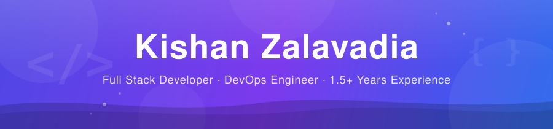

<!-- SEO: Kishan Zalavadia - Full Stack Developer, DevOps Engineer, Software Engineer, India -->

<div align="center">
  
</div>

<br/>

<div align="center">

# 👋 Hey there! I'm **Kishan Zalavadia**

### 🚀 Full Stack Developer &nbsp;·&nbsp; ☁️ DevOps Enthusiast &nbsp;·&nbsp; 🌱 Always Learning

<br/>

📧 [kishanzalavadia12@gmail.com](mailto:kishanzalavadia12@gmail.com) &nbsp;·&nbsp;
💼 [LinkedIn](https://in.linkedin.com/in/kishanzalavadia) &nbsp;·&nbsp;
🐙 [GitHub @12Kishan](https://github.com/12Kishan) &nbsp;·&nbsp;
🌐 [cvjewel.in](https://cvjewel.in/)

</div>

<br/>

---

## 👨‍💻 About Me — Kishan Zalavadia

I'm **Kishan Zalavadia**, a developer with **1.5+ years of hands-on experience** building web applications, cloud infrastructure, and DevOps pipelines. I hold an **AWS Certified Solutions Architect – Associate** certification and enjoy learning by doing — writing code, breaking things, and figuring out why. Currently levelling up my skills one project at a time.

```yaml
name:               Kishan Zalavadia
username:           12Kishan
location:           India
company:            Tech Holding
experience:         1.5+ Years
role:               Full Stack Developer (Learning & Growing)
certifications:     [AWS Certified Solutions Architect – Associate]
skills:
  frontend:         [HTML, CSS, JavaScript, TypeScript, React]
  backend:          [Java, Spring Boot, Node.js]
  cloud:            [AWS - EC2, S3, Lambda, IAM, RDS, CloudWatch]
  devops:           [Docker, Git, Linux, CI/CD, GitHub Actions]
  other:            [Data Analysis, Python basics]
currently_learning: System Design, Kubernetes, Advanced AWS
open_to:            Collaborations, Open Source, Learning Opportunities
```

---

## 🛠️ Tech Stack

<table width="100%">
<tr>
<td align="center" valign="top" width="25%">

**🌐 Frontend**

```
HTML5  ·  CSS3
JavaScript
TypeScript
React
```

</td>
<td align="center" valign="top" width="25%">

**⚙️ Backend**

```
Java  ·  Spring Boot
Node.js
REST APIs
Python
```

</td>
<td align="center" valign="top" width="25%">

**☁️ Cloud — AWS** `✅ Certified`

```
EC2  ·  S3  ·  Lambda
IAM  ·  RDS
CloudWatch  ·  VPC
```

</td>
<td align="center" valign="top" width="25%">

**🛠️ DevOps & Tools**

```
Docker  ·  Linux
Git  ·  GitHub
CI/CD  ·  GitHub Actions
```

</td>
</tr>
</table>

---

## 📊 Skills & Proficiency

<div align="center">

| Skill | Proficiency |
|:------|:------------|
| AWS ☁️ | `███████░░░` AWS Certified ✅ |
| HTML & CSS | `███████░░░` Intermediate |
| JavaScript | `██████░░░░` Intermediate |
| TypeScript | `████░░░░░░` Learning |
| React | `████░░░░░░` Learning |
| Node.js | `█████░░░░░` Beginner–Intermediate |
| Docker & DevOps | `█████░░░░░` Beginner–Intermediate |
| Java & Spring Boot | `████░░░░░░` Beginner |
| Python | `███░░░░░░░` Beginner |

</td>
</div>

---

## 🚀 Featured Projects

<table width="100%">
<tr>
<td width="50%" valign="top">

### 🌐 CVJewel.in &nbsp; `🟢 LIVE`

A real-world web application built and deployed from scratch. Fully functional and live in production.

**Stack:** `HTML` `CSS` `JavaScript` `DevOps`

> [🔗 Visit Live →](https://cvjewel.in/)

</td>
<td width="50%" valign="top">

### 📚 WebDevTutorials

Comprehensive web development resources, templates and learning materials for developers.

**Stack:** `HTML` `CSS` `JavaScript`

> [📂 View Repo →](https://github.com/12Kishan/WebDevTutorials)

</td>
</tr>
<tr>
<td width="50%" valign="top">

### ☕ SpringBoot-Project

Backend REST API application built with Java and Spring Boot framework.

**Stack:** `Java` `Spring Boot` `REST API`

> [📂 View Repo →](https://github.com/12Kishan/SpringBoot-Project)

</td>
<td width="50%" valign="top">

### 📈 Sales-Forecasting

Data analysis and sales prediction project using statistical methods.

**Stack:** `Python` `Data Analysis` `ML Basics`

> [📂 View Repo →](https://github.com/12Kishan/Sales-Forecasting)

</td>
</tr>
</table>

---

## 📈 My 2025 Goals

- 🚀 Contribute to **open source** projects
- ☁️ Get certified in **AWS / Google Cloud**
- 🏗️ Build and deploy **2+ more real-world projects**
- 📚 Learn **System Design** fundamentals
- 🤝 Collaborate with developers worldwide

---

## 🤝 Let's Connect

<div align="center">

I'm always open to interesting conversations and collaboration opportunities. Feel free to reach out!

[](https://github.com/12Kishan)
[](mailto:kishanzalavadia12@gmail.com)
[](https://in.linkedin.com/in/kishanzalavadia)

<!-- | 📧 Email | 💼 LinkedIn | 🐙 GitHub |
|:---:|:---:|:---:|
| [kishanzalavadia12@gmail.com](mailto:kishanzalavadia12@gmail.com) | [kishanzalavadia](https://in.linkedin.com/in/kishanzalavadia) | [12Kishan](https://github.com/12Kishan) | -->

</div>

---

<div align="center">

*"Code is like humor. When you have to explain it, it's bad."* — Cory House

**Kishan Zalavadia** — Building the future, one commit at a time 🚀

<br/>


</div>
